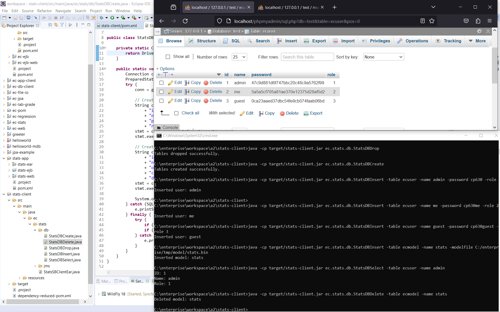
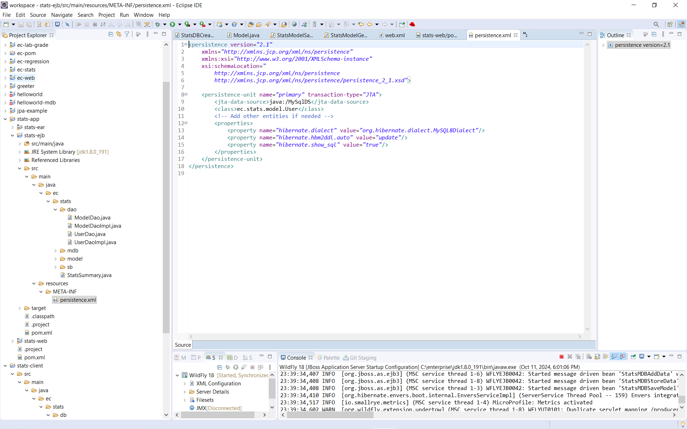
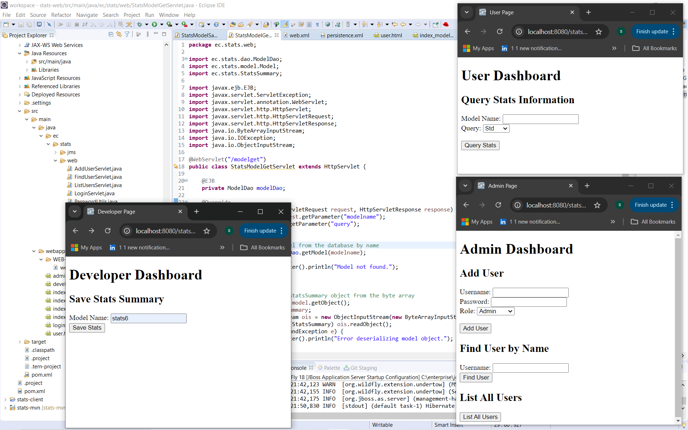
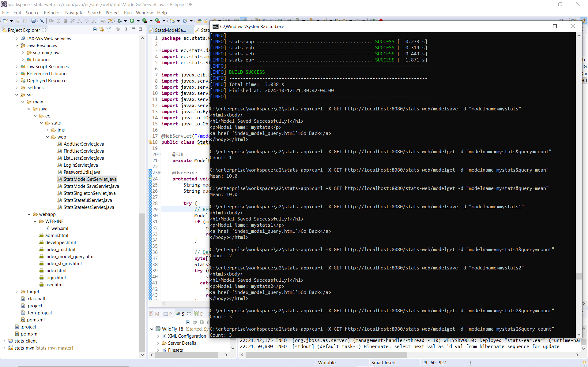
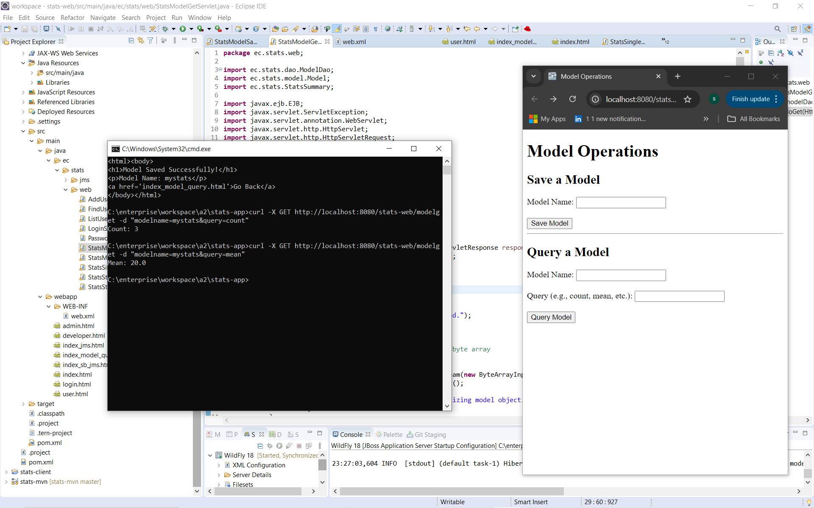
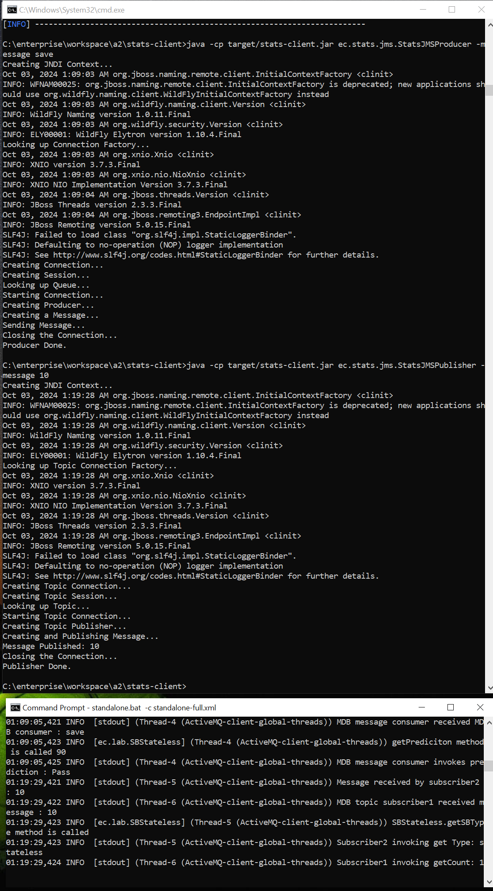
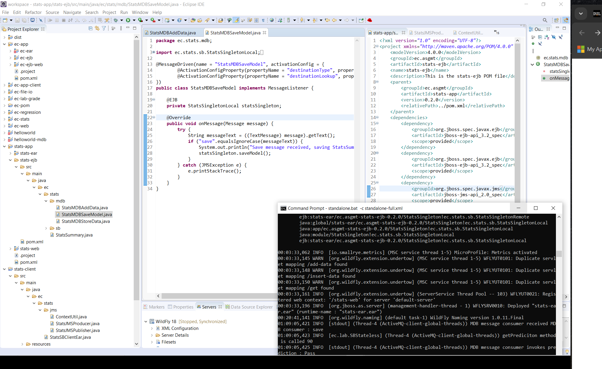
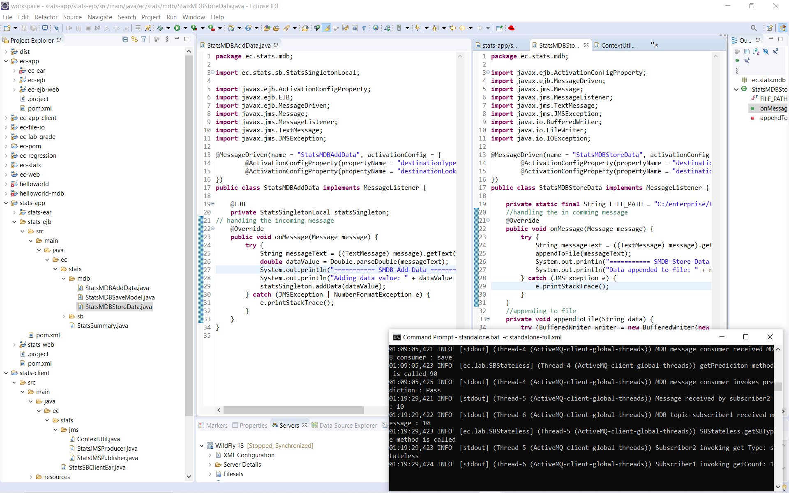
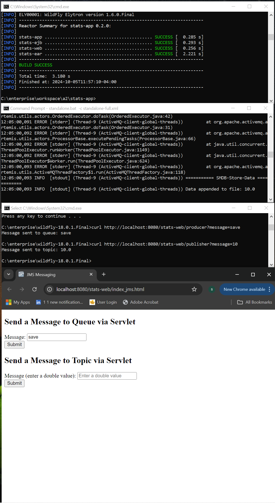
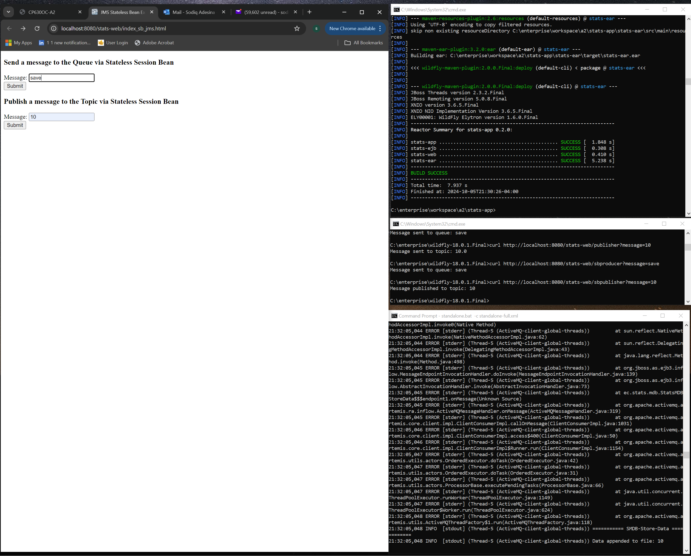

# Enterprise Statistics Platform (JMS + JPA)

Author: Sodiq Adesina 


This project extends the previous *Enterprise Computing Statistics Platform* by integrating **JMS messaging**, **Message-Driven Beans (MDBs)**, and **JPA persistence** into a full-stack enterprise system.  
It demonstrates how EJBs, Servlets, JMS Queues / Topics, and MySQL-backed DAOs cooperate inside a modular Jakarta EE application deployed on **WildFly 18**.


## Architecture
- **EJBs:** Stateless/Stateful/Singleton; one stateless bean exposes JMS helpers.
- **JMS:** Queue & Topic; **MDBs** consume messages to (a) add data, (b) store data, (c) save models.
- **JPA/DAO:** `User`, `Model` entities; DAOs wrap CRUD via the `primary` persistence unit.
- **Web:** Servlets for `add-data`, `get`, `save-model`, `get-model`.
- **Client:** CLI tools for JMS publish/produce and a remote Session Bean client.

### Structure
```bash
Enterprise-statistics-jms-jpa/
│
├── stats-ejb/ # EJBs + MDBs + JPA entities + DAO layer
├── stats-web/ # Servlets + HTML dashboards + JMS interfaces
├── stats-ear/ # EAR packaging and deployment descriptor
└── stats-client/ # Stand-alone JMS producers / publishers / DB scripts
```


## ⚙️ Technologies Used
Java 8 | Jakarta EE (EJB 3.2, JMS, Servlet 4.0, JPA 2.1) | MySQL 8 | WildFly 18 | Maven | JUnit | Log4j  


## 🧠 Core Features
- **JPA Persistence** — entities `User` and `Model` mapped to MySQL (`java:/MySqlDS`) via Hibernate.  
- **JMS Messaging** — Queue (`StatsQueue`) and Topic (`StatsTopic`) used to send numeric/stat messages.  
- **MDB Consumers** — automatically process messages to add data, store data to file, or save the current model.  
- **Role-based Web Dashboards** — Admin adds users, Developer saves stats, User queries models.  
- **Remote Client Support** — command-line tools for DB setup and JMS testing.


## 🧱 Part 1 – JPA Persistence and DAO Testing

### 🧾 Database CRUD Validation
`StatsDBCreate`, `StatsDBInsert`, `StatsDBSelect`, and `StatsDBDelete` were executed from the client.  
MySQL tables `ecuser` and `ecmodel` confirm successful inserts and deletes.



✅ **Explanation:**  
- `StatsDBCreate` created tables.  
- `StatsDBInsert` added `admin`, `me`, and `guest` users.  
- `StatsDBSelect` verified rows from MySQL.  
- Console and phpMyAdmin views match DAO expectations.  


### 👤 User Entity and DAO
`UserDaoImpl` persists users through the `primary` JPA unit with `hibernate.hbm2ddl.auto=update`.

  


✅ **Explanation:**  
JPA generated the `ecuser` table and automatically assigned IDs.  
The console logs show insert and find operations executed through the DAO.


### 🧩 Model Entity and DAO
Models represent serialized statistics objects stored in the DB.

  


✅ **Explanation:**  
The DAO stores and retrieves the `StatsSummary` object.  
JPA confirms SQL `insert` and `select` events in the console.


## 📡 Part 2 – JMS Messaging and MDB Processing

### ✉️ JMS Client (Producers & Publishers)
Standalone clients send messages to the Queue and Topic using JNDI lookup.



✅ **Explanation:**  
- `StatsJMSProducer` → Queue message “save”.  
- `StatsJMSPublisher` → Topic message “10”.  
WildFly logs show each MDB receiving and processing the message.


### 🧮 Message-Driven Beans
Three MDBs handle different aspects of incoming messages.

| MDB Class | Destination | Purpose |
|------------|--------------|---------|
| `StatsMDBAddData` | Topic | Parses numeric messages and adds data to the singleton. |
| `StatsMDBSaveModel` | Queue | Saves current `StatsSummary` to DB (model snapshot). |
| `StatsMDBStoreData` | Queue | Appends raw values to a text file for traceability. |

#### 🧾 Add Data MDB


#### 🧾 Topic MDB


✅ **Explanation:**  
The WildFly console shows the MDBs activated (`Started message driven bean...`).  
When a message “10” is published to the topic, subscribers invoke the stateless bean to update mean and count.


## 💻 Part 3 – Web Dashboard & Servlet Integration

### 🌐 Dashboard Pages
Admin, Developer, and User dashboards invoke different Servlets mapped under `/stats-web/`.



✅ **Explanation:**  
- Admin adds users and lists all records.  
- Developer saves statistical summaries.  
- User queries model count / mean values.  

Each Servlet interacts with its EJB (DAO or JMS helper).  
Outputs confirm data flows from web front-end to backend.


### ⚙️ Servlet + Stateless Bean Integration


✅ **Explanation:**  
Stateless session beans send messages to the Queue and Topic internally.  
The console proves the message “save” and “10” traveled through EJB layers to MDB consumers.


## 🧪 End-to-End JMS Workflow Verification


✅ **Explanation:**  
1. `curl http://localhost:8080/stats-web/producer?message=save` → Queue message → `StatsMDBSaveModel`.  
2. `curl http://localhost:8080/stats-web/publisher?message=10` → Topic message → `StatsMDBAddData` + `StatsMDBStoreData`.  
3. Logs confirm “Data appended to file: 10” and model saved in DB.  
4. Web query Servlet retrieves mean and count (`count=3`, `mean=20`).


## 🧾 Persistence Configuration

```xml
<persistence-unit name="primary" transaction-type="JTA">
  <jta-data-source>java:/MySqlDS</jta-data-source>
  <class>ec.stats.model.User</class>
  <class>ec.stats.model.Model</class>
  <properties>
    <property name="hibernate.dialect" value="org.hibernate.dialect.MySQL8Dialect"/>
    <property name="hibernate.hbm2ddl.auto" value="update"/>
    <property name="hibernate.show_sql" value="true"/>
  </properties>
</persistence-unit>
```
✅ Explanation:
The persistence.xml links Hibernate to MySQL and automatically creates entity tables.

### 🚀 Build and Run Guide

```bash
# 1. Build and package
mvn clean package

# 2. Deploy EAR to WildFly
cd stats-app
mvn wildfly:deploy

# 3. Open dashboards
http://127.0.0.1:8080/stats-web/

# 4. Run JMS client tools
cd stats-client
java -cp target/stats-client.jar ec.stats.jms.StatsJMSProducer -m save
java -cp target/stats-client.jar ec.stats.jms.StatsJMSPublisher -m 10

```

🧩 Future Improvements

Add REST APIs (JAX-RS) for AJAX front-end integration.

Implement role-based login via Elytron.

Containerize WildFly and MySQL with Docker Compose.

Add unit tests for MDB consumers and DAO methods.